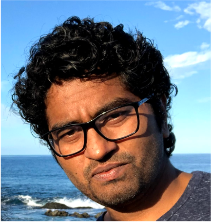

# Prasanna Sattigeri

Research Staff Member,
IBM Research AI

Google Scholar: [https://scholar.google.com/citations?hl=en&amp;user=m-s38ikAAAAJ&amp;view\_op=list\_works](https://scholar.google.com/citations?hl=en&amp;user=m-s38ikAAAAJ&amp;view_op=list_works)

**Education**

Ph.D. Electrical Engineering; Dec. 2014

- School of ECEE, Arizona State University, Tempe, AZ

- Research Advisor: Andreas Spanias

-  Thesis Title: Exploring Latent Structure in Data: Algorithms and Implementations

Bachelor of Technology, Electronics Engineering; Apr. 2008

 - National Institute of Technology, India.

**Professional Experience**

_Research Staff Member_ Dec. 2015-present

IBM Thomas J. Watson Research Center, NY, 10598

Responsibilities:

- Conduct research on foundational topics in machine learning and artificial intelligence including efficiency, robustness, interpretability and trustworthiness of AI models.
- Develop analytical tools to solve challenging business problems.
- Disseminate research results through scholarly publications and generate intellectual property.
- Development of tools for computer vision, natural language processing, healthcare and signal processing.

Selected Projects:

- Leading a joint project with MIT through the MIT-IBM Watson AI Lab to conduct research on machine learning with limited human supervision, domain generalization and transfer learning of the models. This work produced publications at top venues in AI field and a patent application which is currently under internal review.
- Designed and developed the technique of co-regularization that produced state-of-the-art results for unsupervised domain adaptation.
- Investigated the issues of domain shift in healthcare machine learning models and proposed benchmarks. This work received the best paper award.
- Developed innovative techniques to use the generative adversarial networks for semi-supervised learning. This achieved state-of-the-art on several vision tasks and results was presented at Neural Information Processing Systems.
- Conducted research on interpretability using generative models and proposed a new regularizer for variational autoencoder to promote disentanglement. This was then used to obtain contrastive explanation for model decisions. Resulted in publications and a patent application.
- Developed techniques to enhance the latent space of generative models to promote algorithmic fairness and interpretability. Contributed to the development of the AI Fairness and Explainability research toolbox that has seen wide adoption from researchers and practitioners. Received worldwide media attention and coverage.

_Software Engineer_ Dec. 2014 to Dec. 2015

Yelp Inc., San Francisco, CA

- Developed machine learning algorithms and incorporated them into products used by large consumer userbase.
- Proposed natural language processing techniques and image understanding algorithms to improve search results for user queries. Part of the work was covered by media outlets.
- Prototyped systems for quantitative measurement of the deployed data science algorithms.

_Research Assistant_ Jan. 2009 to Dec. 2014

School of ECEE, Arizona State University, Tempe, AZ 85287

- Designed and developed methods that learn a hierarchy of representations in an unsupervised fashion by capturing the low rank and sparse structure of the data.
- Proposed methods to leverage multiple simple sparse coding models to create a strong ensemble that is easy to train.
- Developed a sparse code based framework for image classification and retrieval using sub-images. Proposed modifications to the algorithm to be efficient on a GPU.
- Developed novel feature learning techniques for analyzing data from wide range of modalities such as images, audio and electronics-nose sensors.
- Lead student researcher on an NSF project on developing ion-channel sensors and developed new feature extraction and classification algorithms.  Produced novel results on an NIH project dealing with sensors for diesel exhaust detection. This led to several publications.
- Contributed several new functions in ASU Java DSP program which was used for signal processing education.
- Multidisciplinary collaboration with faculty from the ASU Center for Solid State Research, the BioDesign Institute, the School of Sustainability, and a team of chemists from UC-Riverside.

_Teaching Assistant_ Aug. 2011 to Dec. 2013

School of ECEE, Arizona State University, Tempe, AZ 85287

- Served as TA for Signals and Systems course which covered the fundamentals of DSP, communication and control systems.
- Responsibilities included updating, conducting and grading lab sessions.
- Assisted around 400 students.

**Research Interests**

Machine learning, artificial intelligence, signal processing, generative modeling, AI trustworthiness and applications to computer vision, healthcare and other data science problems.

**Honors and Awards**

- IBM Outstanding Technical Achievement Award for contributions to Trustworthy AI (2019).
- IBM Research Technical Achievement Award for contributions to the:
  - Science of Uncertainty Quantification (2021),
  - Science of accurate, robust, and generalizable AI (2021),
  - Science in the Learning with Less Labels (LwLL) Domain (2020),
  - Development of Dynamic Neural Networks for Efficient AI (2020).
- Harvard Belfer Center Tech Spotlight runner-up for AI Fairness 360 (2020).
- Best Paper at KDD 2019 in the Applied Data Science for Healthcare Workshop (2019).
- University Graduate Fellowship by the School of ECEE, Arizona State University (2014).

**Professional Service**

- Senior Program Committee / Area Chair - AAAI 2021, ICLR 2018.
- Associate Editor - Digital Signal Processing, Pattern Recognition.
- Organizer - Workshop on Practical Bayesian Methods for Big Data (PBMB), AI Research Week, MIT, 2019.
- Organizer - AAAI Fall Symposium on Gathering for Artificial Intelligence And Natural Systems (GAINS), 2018.
- Reviewer - NeurIPS, ICML, AAAI, IEEE Trans. PAMI, IEEE Trans. Signal Proc. and others.

**Invited Talks, Tutorials and Panels**

- Invited Talk - Trustworthy AI Toolkits, KDD Responsible AI Workshop, 2021.
- Tutorial - AI Uncertainty Quantification, PyData Global 2021.
- Tutorial - UQ360, a hands on tutorial., ACM CODS-COMAD, 2021.
- Invited Talk - AI Uncertainty Quantification, ARC Training Centre in Cognitive Computing for Medical Technologies, 2021.
- Invited Talk and Panel: Trusted AI, AI Research Week, MIT Samberg Center, Cambridge, MA, USA (Sept. 2019).
- Invited Talk and Tutorial: AI Fairness, Compute Fest, Harvard&#39;s Institute for Applied Computational Science, Cambridge, MA, USA (Jan. 2019).
- Invited Talk and Panel: AI and Trust, AAAI Fall Symposium on Artificial Intelligence in Government and Public Sector, (Oct. 2018).

**Selected Press Coverage**

- &quot;IBM launches tool aimed at detecting AI bias&quot;, by Zoe Kleinman, BBC News, 19 September 2018.
- &quot;What to do when your ML model suffers from overconfidence?&quot;, by Riya Pahuja, ETCIO, Economic Times, November 3, 2021.
- &quot;What to do when AI brings more questions than answers?&quot;, by Kyle Wiggers, Venturebeat, July 16, 2021.
- &quot;IBM is teaching AI models to express how confident they are about their decisions&quot;, by Mike Wheatley, siliconAngle, June 8, 2021.

**Selected Publications**

_Journal Articles_

1. Joshua Lee, Yuheng Bu, Prasanna Sattigeri, Rameswar Panda, Gregory W. Wornell, Leonid Karlinsky, and Rogerio Schmidt Feris. &quot;A Maximal Correlation Framework for Fair Machine Learning.&quot; _Entropy_ 24, no. 4 (2022): 461.
2. Galhotra, Sainyam, Karthikeyan Shanmugam, Prasanna Sattigeri, and Kush R. Varshney. &quot;Interventional Fairness with Indirect Knowledge of Unobserved Protected Attributes.&quot; _Entropy_ 23, no. 12 (2021): 1571.
3. Bellamy, Rachel KE, et al. &quot;Think Your Artificial Intelligence Software Is Fair? Think Again.&quot; _IEEE Software 36.4_ (2019): 76-80.
4. Bellamy, Rachel KE, et al. &quot;AI Fairness 360: An Extensible Toolkit for Detecting, Understanding, and Mitigating Unwanted Algorithmic Bias.&quot; IBM Journal of Research and Development, AI Ethics Issue (2019).
5. Prasanna Sattigeri, Samuel C Hoffman, Vijil Chenthamarakshan, and Kush R Varshney. Fairness GAN: Generating Datasets with Fairness Properties. IBM Journal of Research and Development, AI Ethics Issue (2019).
6. Huan Song, Jayaraman J Thiagarajan, Prasanna Sattigeri, and Andreas Spanias. Optimizing kernel machines using deep learning. _IEEE Transactions on Neural Networks and Learning Systems_, 2018.
7. Pham, K. T., Prasanna Sattigeri, Amit Dhurandhar, A. C. Jacob, M. Vukovic, P. Chataigner, Juliana Freire, A. Mojsilović, and Kush R. Varshney. &quot;Real-time understanding of humanitarian crises via targeted information retrieval.&quot; _IBM Journal of Research and Development_ 61, no. 6 (2017): 7-1.
8. Kuhlman, Caitlin, Karthikeyan Natesan Ramamurthy, Prasanna Sattigeri, Aurélie C. Lozano, Lei Cao, Chandra Reddy, Aleksandra Mojsilović, and Kush R. Varshney. &quot;How to foster innovation: A data-driven approach to measuring economic competitiveness.&quot; _IBM Journal of Research and Development_ 61, no. 6 (2017): 11-1.
9. Xiangyu Bi, Sungyun Lee, James F Ranville, Prasanna Sattigeri, Andreas Spanias, Pierre Herckes, and Paul Westerhoff. Quantitative resolution of nanoparticle sizes using single particle inductively coupled plasma mass spectrometry with the k-means clustering algorithm. _Journal of Analytical Atomic Spectrometry_, 29(9):1630–1639, 2014.
10. Hyuntae Kim, Bharatan Konnanath, Prasanna Sattigeri, Joseph Wang, Ashok Mulchandani, Nosang Myung, Marc A Deshusses, Andreas Spanias, and Bertan Bakkaloglu. Electronic-nose for detecting environmental pollutants: Signal processing and analog front-end design. _Analog Integrated Circuits and Signal Processing_, 70(1):15–32, 2012.
11. Karthikeyan Natesan Ramamurthy, Jayaraman J Thiagarajan, Prasanna Sattigeri, Michael Goryll, Andreas Spanias, Trevor Thornton, and Stephen M Phillips. Transform domain features for ion-channel signal classification. _Biomedical Signal Processing and Control_, 6(3):219–224, 2011.

_Conference Proceedings_

1. Abhin Shah, Yuheng Bu, Joshua Lee, Prasanna Sattigeri, Ramweswar Panda Subhro Das, &amp; Gregory Wornell. &quot;Selective Regression Under Fairness Criteria&quot;. _In International Conference on Machine Learning (ICML),_ 2022.
2. Joshua Lee, Yuheng Bu, Prasanna Sattigeri, Rameswar Panda, Gregory Wornell, Leonid Karlinsky, and Rogerio Feris. &quot;A maximal correlation approach to imposing fairness in machine learning.&quot; In ICASSP 2022-2022 _IEEE International Conference on Acoustics, Speech and Signal Processing_ (ICASSP), pp. 3523-3527. IEEE, 2022.
3. Varici, Burak, Karthikeyan Shanmugam, Prasanna Sattigeri, and Ali Tajer. &quot;Intervention Target Estimation in the Presence of Latent Variables.&quot; In _The 38th Conference on Uncertainty in Artificial Intelligence._ 2022.
4. Ghosh, Soumya, Q. Vera Liao, Karthikeyan Natesan Ramamurthy, Jiri Navratil, Prasanna Sattigeri, Kush Varshney, and Yunfeng Zhang. &quot;Uncertainty Quantification 360: A Hands-on Tutorial.&quot; In _5th Joint International Conference on Data Science &amp; Management of Data (9th ACM IKDD CODS and 27th COMAD),_ pp. 333-335. 2022.
5. Varici, Burak, Karthikeyan Shanmugam, Prasanna Sattigeri, and Ali Tajer. &quot;Scalable Intervention Target Estimation in Linear Models.&quot; _Advances in Neural Information Processing Systems_ 34 (2021): 1494-1505.
6. Ahuja, Kartik, Prasanna Sattigeri, Karthikeyan Shanmugam, Dennis Wei, Karthikeyan Natesan Ramamurthy, and Murat Kocaoglu. &quot;Conditionally independent data generation.&quot; In _Uncertainty in Artificial Intelligence_, pp. 2050-2060. PMLR, 2021.
7. Ronny Luss, Pin-Yu Chen, Amit Dhurandhar, Prasanna Sattigeri, Yunfeng Zhang, Karthikeyan Shanmugam, and Chun-Chen Tu. &quot;Leveraging latent features for local explanations.&quot; In _Proceedings of the 27th ACM SIGKDD Conference on Knowledge Discovery &amp; Data Mining_, pp. 1139-1149. 2021.
8. Umang Bhatt, Javier Antorán, Yunfeng Zhang, Q. Vera Liao, Prasanna Sattigeri, Riccardo Fogliato, Gabrielle Melançon et al. &quot;Uncertainty as a form of transparency: Measuring, communicating, and using uncertainty.&quot; In _Proceedings of the 2021 AAAI/ACM Conference on AI, Ethics, and Society_, pp. 401-413. 2021.
9. Joshua K. Lee, Yuheng Bu, Deepta Rajan, Prasanna Sattigeri, Rameswar Panda, Subhro Das, and Gregory W. Wornell. &quot;Fair Selective Classification via Sufficiency.&quot; In _International Conference on Machine Learning_, pp. 6076-6086. PMLR, 2021.
10. Kinyanjui, Newton M., Timothy Odonga, Celia Cintas, Noel CF Codella, Rameswar Panda, Prasanna Sattigeri, and Kush R. Varshney. &quot;Fairness of classifiers across skin tones in dermatology.&quot; In _International Conference on Medical Image Computing and Computer-Assisted Intervention_, pp. 320-329. Springer, Cham, 2020.
11. Tatro, Norman, Pin-Yu Chen, Payel Das, Igor Melnyk, Prasanna Sattigeri, and Rongjie Lai. &quot;Optimizing mode connectivity via neuron alignment.&quot; _Advances in Neural Information Processing Systems_ 33 (2020): 15300-15311.
12. Thiagarajan, Jayaraman J., Bindya Venkatesh, Prasanna Sattigeri, and Peer-Timo Bremer. &quot;Building calibrated deep models via uncertainty matching with auxiliary interval predictors.&quot; In _AAAI Conference on Artificial Intelligence_. AAAI press, 2020.
13. Joshua Lee, Prasanna Sattigeri and Gregory Wornell. Learning New Tricks From Old Dogs: Multi-Source Transfer Learning From Pre-Trained Networks. In _Advances in Neural Information Processing Systems,_ 2019.
14. Thiagarajan, Jayaraman J., Deepta Rajan, and Prasanna Sattigeri. Understanding Behavior of Clinical Models under Domain Shifts, KDD Applied Data Science for Healthcare, Alaska, USA (Aug 2019). **(Best Paper)**
15. Arya, Vijay, et al. &quot;One Explanation Does Not Fit All: A Toolkit and Taxonomy of AI Explainability Techniques.&quot; _arXiv preprint arXiv:1909.03012_ (2019).
16. Abhishek Kumar, Prasanna Sattigeri, Kahini Wadhawan, Leonid Karlinsky, Rogerio Feris, Bill Freeman, and Gregory Wornell. &quot;Co-regularized alignment for unsupervised domain adaptation.&quot; _In Advances in Neural Information Processing Systems_, pp. 9345-9356. 2018.
17. Abhishek Kumar, Prasanna Sattigeri, and Avinash Balakrishnan. Variational inference of disentangled latent concepts from unlabeled observations. _ICLR_, 2018.
18. Prasanna Sattigeri, Abhishek Kumar, and Tom Fletcher. Semi-supervised learning with gans: manifold invariance with improved inference. In _Advances in Neural Information Processing Systems, NIPS_, pages 5534–5544, 2017.
19. Huan Song, Jayaraman J Thiagarajan, Prasanna Sattigeri, Karthikeyan Natesan Ramamurthy, and Andreas Spanias. A deep learning approach to multiple kernel fusion. In _Acoustics, Speech and Signal Processing (ICASSP), 2017 IEEE International Conference on_, pages 2292–2296. IEEE, 2017.
20. Yuanshuo Zhao, Ioana Baldini, Prasanna Sattigeri, Inkit Padhi, Yoong Keok Lee, and Ethan Smith. Data driven techniques for organizing scientific articles relevant to biomimicry. _AIES-AAAI_, 2017.
21. Prasanna Sattigeri and Jayaraman J Thiagarajan. Sparsifying word representa- tions for deep unordered sentence modeling. In _Proceedings of the 1st Workshop on Representation Learning for NLP, ACL_, pages 206–214, 2016.
22. Jayaraman J Thiagarajan, Bhavya Kailkhura, Prasanna Sattigeri, and Karthikeyan Natesan Ramamurthy. Treeview: Peeking into deep neural net- works via feature-space partitioning. _arXiv preprint arXiv:1611.07429, NIPS Workshop_, 2016.
23. Jayaraman J Thiagarajan, Prasanna Sattigeri, Karthikeyan Natesan Ramamurthy, and Bhavya Kailkhura. Robust local scaling using conditional quantiles of graph similarities. _arXiv preprint arXiv:1612.04875 IEEE ICDM Workshop_, 2016.
24. Aurélie C Lozano, Prasanna Sattigeri, Aleksandra Mojsilović, and Kush R Varshney. Stable estimation of granger-causal factors of country-level innovation. In _Signal and Information Processing (GlobalSIP), 2016 IEEE Global Conference on_, pages 1290–1294. IEEE, 2016.
25. Prasanna Sattigeri, Aurélie Lozano, Aleksandra Mojsilović, Kush R Varshney, and Mahmoud Naghshineh. Understanding innovation to drive sustainable development. _arXiv preprint arXiv:1606.06177 ICML Workshop_, 2016.
26. Prasanna Sattigeri, Jayaraman J Thiagarajan, Mohit Shah, Karthikeyan Nate- san Ramamurthy, and Andreas Spanias. A scalable feature learning and tag prediction framework for natural environment sounds. In _Signals, Systems and Computers, 2014 48th Asilomar Conference on_, pages 1779–1783. IEEE, 2014.
27. Jayaraman J Thiagarajan, Karthikeyan Natesan Ramamurthy, Prasanna Sattigeri, Peer-Timo Bremer, and Andreas Spanias. Automatic image annotation using inverse maps from semantic embeddings. In _Image Processing (ICIP), 2014 IEEE International Conference on_, pages 3107–3111. IEEE, 2014.
28. Karthikeyan Natesan Ramamurthy, Jayaraman J Thiagarajan, Prasanna Sattigeri, and Andreas Spanias. Ensemble sparse models for image analysis. _arXiv preprint arXiv:1302.6957_, 2013.
29. Karthikeyan Natesan Ramamurthy, Jayaraman J Thiagarajan, Andreas Spanias, and Prasanna Sattigeri. Boosted dictionaries for image restoration based on sparse representations. In _Acoustics, Speech and Signal Processing (ICASSP), 2013 IEEE International Conference on_, pages 1583–1587. IEEE, 2013.
30. P Sattigeri, JJ Thiagarajan, K Natesan Ramamurthy, A Spanias, M Goryll, and T Thornton. De-noising and event extraction for silicon pore sensors using matrix decomposition. _SSPD_, 2012.
31. Prasanna Sattigeri, Jayaraman J Thiagarajan, Karthikeyan N Ramamurthy, and Andreas Spanias. Implementation of a fast image coding and retrieval system using a gpu. In _Emerging Signal Processing Applications (ESPA), 2012 IEEE International Conference on_, pages 5–8. IEEE, 2012.
32. Karthikeyan Natesan Ramamurthy, Jayaraman J Thiagarajan, Prasanna Sattigeri, and Andreas Spanias. Learning dictionaries with graph embedding constraints. In _Signals, Systems and Computers (ASILOMAR), 2012 Conference Record of the Forty Sixth Asilomar Conference on_, pages 1974–1978. IEEE, 2012.
33. Jayaraman J Thiagarajan, Karthikeyan Natesan Ramamurthy, Prasanna Sattigeri, and Andreas Spanias. Supervised local sparse coding of sub-image features for image retrieval. In _ICIP_ 2012.
34. P Sattigeri, J Thiagarajan, K Ramamurthy, A Spanias, M Goryll, and T Thorn- ton. Robust psd features for ion-channel signals. In _Sensor Signal Processing for Defence 2011_, 2011.
35. P Sattigeri, KN Ramamurthy, JJ Thiagarajan, M Goryll, A Spanias, and T Thornton. Analyte detection using an ion-channel sensor array. In _Digital Signal Processing (DSP), 2011 17th International Conference on_, pages 1–6. IEEE, 2011.
36. P Sattigeri, JJ Thiagarajan, KN Ramamurthy, P Joshi, A Spanias, M Goryll, and T Thornton. Analysis of coulter counting data from nanopores using clustering. In _Sensor Signal Processing for Defence 2010_, 2010.
37. Prasanna Sattigeri, JJ Thiagarajan, KN Ramamurthy, B Konnanath, T Mathew, Andreas Spanias, M Goryll, T Thornton, S Prasad, and S Phillips. Signal processing for biologically inspired sensors. In _Communications, Control and Signal Processing (ISCCSP), 2010 4th International Symposium on_, pages 1–5. IEEE, 2010.
38. Ramamurthy, Karthikeyan Natesan, Jayaraman J. Thiagarajan, Prasanna Sattigeri, Bharatan Konnanath, Andreas Spanias, Trevor Thornton, Shalini Prasad, Michael Goryll, Stephen Phillips, and Stephen Goodnick. &quot;Transform domain features for ion-channel signal classification using support vector machines.&quot; In 2009 9th _International Conference on Information Technology and Applications in Biomedicine_, pp. 1-4. IEEE, 2009.
39. Konnanath, Bharatan, Prasanna Sattigeri, Trupthi Mathew, Andreas Spanias, Shalini Prasad, Michael Goryll, Trevor Thornton, and Peter Knee. &quot;Acquiring and classifying signals from nanopores and ion-channels.&quot; _In International Conference on Artificial Neural Networks_, pp. 265-274. Springer, Berlin, Heidelberg, 2009.

**Patents**

- Ronny Luss, Pin-Yu Chen, Amit Dhurandhar, Prasanna Sattigeri, and Karthikeyan Shanmugam. &quot;Contrastive explanations for images with monotonic attribute functions.&quot; U.S. Patent 11,222,242, issued January 11, 2022.
- Ramamurthy, Karthikeyan, Jayaraman Thiagarajan, Prasanna Sattigeri, and Andreas Spanias. &quot;Ensemble sparse models for image analysis and restoration.&quot; U.S. Patent 9,875,428, issued January 23, 2018.
- Pin-Yu Chen, Payel Das, Igor Melnyk, Prasanna Sattigeri, Rongjie Lai, and Norman Tatro. &quot;Efficient search of robust accurate neural networks.&quot; U.S. Patent Application 16/926,407, filed January 13, 2022.
- Lee, Joshua Ka-Wing, Prasanna Sattigeri, and Gregory Wornell. &quot;Multi-source transfer learning from pre-trained networks.&quot; U.S. Patent Application 16/843,173, filed October 14, 2021.

**Membership**

IEEE Member
